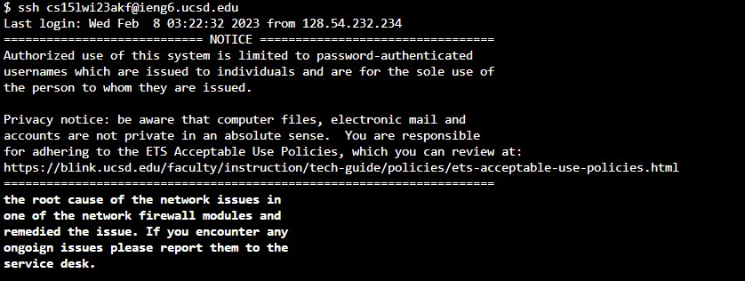
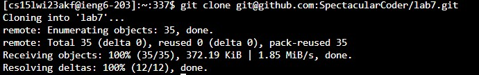
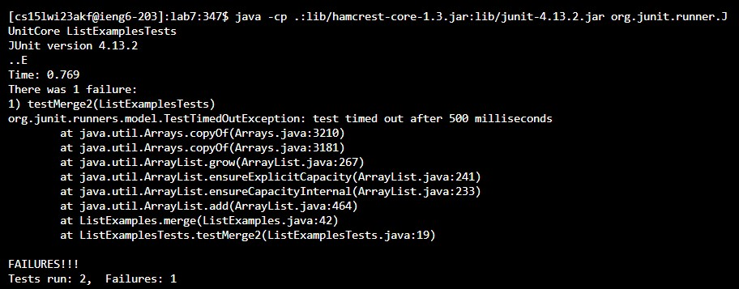

# -cse-15l-lab-report-week8
## Lab Report 3
### Reporforming the Challenge Tasks From Lab (Steps 4-9)

### Step 4 Log into ieng6
**Image:**



**Keys Pressed:** 
```
# Keys Pressed
<ctrl>+<c><ctrl>+<v>ssh cs15lwi23zz@ieng6.ucsd.edu <leftkey> until it reaches @ <backtab><backtab> akf <enter>
```

**Summary:** For this particular step I went to Week 1 where we first learned about ssh. I copied and pasted the generic example of ssh login.
```
# code block
ssh cs15lwi23zz@ieng6.ucsd.edu
```
Copying this basic code block first with ctrl + c. I went back into my terminal and did ctrl + v to paste this into my terminal. With this pasted, I had to adjust the generic form zz to my designated letter combination for my ieng6 account. Thus I use the left key until it reaches tha @ symbol in the generic ieng6 account(about 15 left keys if pressed one at a time, but I simply just pressed left key until it navigated there). Backtab to delete the 2 letter z, then simply typed out akf for my account and hit enter to sign in. The login process was made smooth, because the laptop was registered as a valid user for the designated ieng6 account through the ssh setup so it was not necessary to type a password to login. 

 **[Details of The SSH Setup Can be Found Here](https://ucsd-cse15l-w23.github.io/week/week7/#week7-lab-report)**
### Step 5 Clone your fork of the repository from your Github account
**Image:**



**Keys Pressed:**
```
# Keys Pressed
<up><ctrl>+<c><ctrl>+<v><enter>
```
  
**Summary:** 
I pressed up, because before I completed this cloning step I messed up my git clone. However, because of this I can simply use the up key as now the git clone command is saved in my history. With this, I press ctrl v to paste the ssh link obtained from my forked github repository for lab7. Then finally I hit enter, which starts the cloning process.

***Why Use SSH link?***

The setup for ssh is already done so I used the ssh link. This is made possible because in Week 7 Lab, we generated a SSH github key that we attached into out gitHub account. This will essentially make the process of pushing and committing a lot eaiser than doing it in regular clone setting without the use of a ssh key.

**[Details of The SSH Github Setup Can be Found Here](https://ucsd-cse15l-w23.github.io/week/week7/#week7-lab-report)**

### Step 6 Run the tests, demonstrating that they fail
**Image:**


**Keys Pressed:**
```
# Keys Pressed
cd l<tab><ctrl>+<c><ctrl>+v><enter><ctrl>+<c><ctrl>+v><ctrl><w><shift>l<tab><shift>t<tab><enter>
```
**Summary:** I typed cd l and pressed tab to automate so it autocompletes l to lab7. Then I went back to Week 3 lab about compiling and running junit tests through the command line. I copy and pasted:
```
# code block
javac -cp .:lib/hamcrest-core-1.3.jar:lib/junit-4.13.2.jar *.java 
```
This command will first compile all java files within lab7. Then I went back to Week 3 lab to copy the Junit test command.
```
# code block
java -cp .:lib/hamcrest-core-1.3.jar:lib/junit-4.13.2.jar org.junit.runner.JUnitCore ArrayTests
JUnit version 4.13.2
```

The issue with this copy and pasted command is it uses a generic test type ArrayTests, which is not something we have inside our current lab7 test file. So I used ctrl w to first delete the word ArrayTests. Then I shift l, indicating a captilized L, I press tab so it would autocomplete it to ListExamples. However, it is still missing the word test. So similar process, ctrl + t then tab to make it autocomplete to Test. Now the whole phrase ListExamplesTest replaces ArrayTest, pressing enter would run this Junit test on the ListExamplesTest file.
### Step 7 Edit the code file to fix the failing test
**Image:**


**Keys Pressed:**

**Summary:**

### Step 8 Run the tests, demonstrating that they now succeed
**Image:**


**Keys Pressed:**

**Summary:**

### Step 9 Commit and push the resulting change to your Github account
**Image:**


**Keys Pressed:**

**Summary:**
