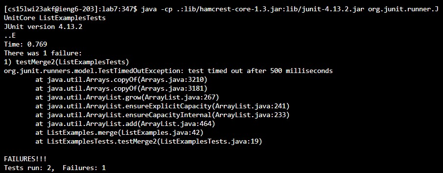
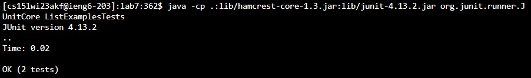
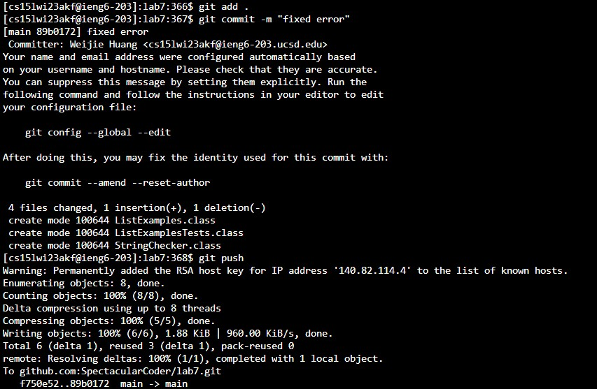
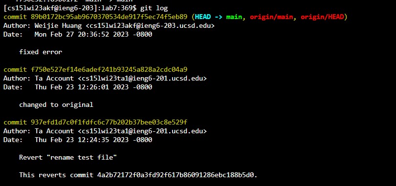
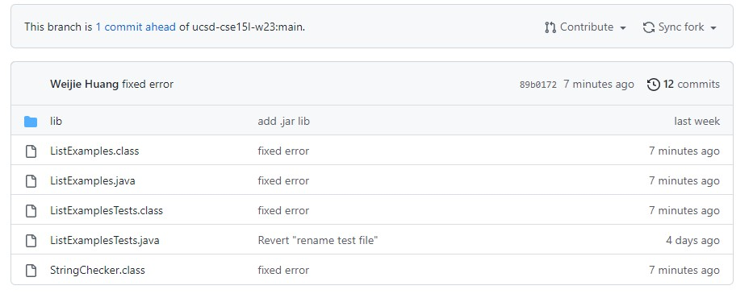

# -cse-15l-lab-report-week8
## Lab Report 3
### Reporforming the Challenge Tasks From Lab (Steps 4-9)

### Step 4 Log into ieng6
**Image:**


**Keys Pressed:** 
```
# Keys Pressed
<ctrl>+<c><ctrl>+<v>ssh cs15lwi23zz@ieng6.ucsd.edu <leftkey> until it reaches @ <backtab><backtab> akf <enter>
```

**Summary:** For this particular step I went to Week 1 where we first learned about ssh. I copied and pasted the generic example of ssh login.
```
# code block
ssh cs15lwi23zz@ieng6.ucsd.edu
```
Copying this basic code block first with ctrl + c. I went back into my terminal and did ctrl + v to paste this into my terminal. With this pasted, I had to adjust the generic form zz to my designated letter combination for my ieng6 account. Thus I use the left key until it reaches tha @ symbol in the generic ieng6 account(about 15 left keys if pressed one at a time, but I simply just pressed left key until it navigated there). Backtab to delete the 2 letter z, then simply typed out akf for my account and hit enter to sign in. The login process was made smooth, because the laptop was registered as a valid user for the designated ieng6 account through the ssh setup so it was not necessary to type a password to login. 

 **[Details of The SSH Setup Can be Found Here](https://ucsd-cse15l-w23.github.io/week/week7/#week7-lab-report)**
### Step 5 Clone your fork of the repository from your Github account
**Image:**


**Keys Pressed:**
```
# Keys Pressed
<up><ctrl>+<c><ctrl>+<v><enter>
```
  
**Summary:** 
I pressed up, because before I completed this cloning step I messed up my git clone. However, because of this I can simply use the up key as now the git clone command is saved in my history. With this, I press ctrl v to paste the ssh link obtained from my forked github repository for lab7. Then finally I hit enter, which starts the cloning process.

***Why Use SSH link?***

The setup for ssh is already done so I used the ssh link. This is made possible because in Week 7 Lab, we generated a SSH github key that we attached into out gitHub account. This will essentially make the process of pushing and committing a lot eaiser than doing it in regular clone setting without the use of a ssh key.

**[Details of The SSH Github Setup Can be Found Here](https://ucsd-cse15l-w23.github.io/week/week7/#week7-lab-report)**

### Step 6 Run the tests, demonstrating that they fail
**Image:**


**Keys Pressed:**
```
# Keys Pressed
cd l<tab><ctrl>+<c><ctrl>+v><enter><ctrl>+<c><ctrl>+v><ctrl><w><shift>l<tab><shift>t<tab><enter>
```
**Summary:** I typed cd l and pressed tab to automate so it autocompletes l to lab7. Then I went back to Week 3 lab about compiling and running junit tests through the command line. I copy and pasted:
```
# code block
javac -cp .:lib/hamcrest-core-1.3.jar:lib/junit-4.13.2.jar *.java 
```
This command will first compile all java files within lab7. Then I went back to Week 3 lab to copy the Junit test command.
```
# code block
java -cp .:lib/hamcrest-core-1.3.jar:lib/junit-4.13.2.jar org.junit.runner.JUnitCore ArrayTests
JUnit version 4.13.2
```

The issue with this copy and pasted command is it uses a generic test type ArrayTests, which is not something we have inside our current lab7 test file. So I used ctrl w to first delete the word ArrayTests. Then I shift l, indicating a captilized L, I press tab so it would autocomplete it to ListExamples. However, it is still missing the word test. So similar process, ctrl + t then tab to make it autocomplete to Test. Now the whole phrase ListExamplesTest replaces ArrayTest, pressing enter would run this Junit test on the ListExamplesTest file.
### Step 7 Edit the code file to fix the failing test
**Image:**


**Keys Pressed:**
```
# Keys Pressed
nano <shift>l<tab>.j<tab><enter><down arrow key> until it reaches the error 
which occurs at index1 += 1;<right arrowkey> until it reaches the space after 
1 <backspace>2<ctrl>+<x><y>
```
**Summary:** I typed nano, shift l to capitlize to L then pressed tab to make it autocomplete to ListExamples, I typed . and j and pressed tab to make it autocomplete to ListExamples.java. To navigate the file through nano, I pressed down arroy key until I reached the error. 

Error:
```
# code block
while(index2 < list2.size()) {
      result.add(list2.get(index2));
      index1 += 1;
```
Once at the error, I used the right arrowkey to navigate to the space before the 1. I press backtab to delete the 1, and pressed 2 to ultimately fix the error. With the error fixed, I press ctrl x to exit out of nano and y to confirm yes that I want to exit out.

### Step 8 Run the tests, demonstrating that they now succeed
**Image:**



**Keys Pressed:**
```
# Keys Pressed
<up><enter><up><up><enter>
```
**Summary:** To test if the error is fixed, I simply pressed up and enter to recompile my code as the command for compiling java files in in my history. Then I clicked up, up to get the the command to run the junit test on ListExamplesTests, I press enter and it runs the code with no errors now.

### Step 9 Commit and push the resulting change to your Github account
**Image:**



**Keys Pressed:**
```
# Keys Pressed
git add . <up><enter> git push<enter>
```
**Summary:** I did git add . to add the new or changed files to the git staging area to prompt the abilities of git commit. I called git commit -m "fixed error" earlier before calling git add . which caused a issue since git add . is needed for git commit to work. However, because now git commit -m "fixed error" is in my command history I can simply press tab and enter to run that command without retyping it. Next I simply typed git push to finally push the change and commit to my github repo.

**Proof that Commit and Push Worked**



Using git log, you can see all the modifications done on this repo. As seen, the recent git commit with the message "fixed error" is the most recent update to the file indicating the git commit successfully committed the file.


Looking at the repo, it shows the file classes which indicates that they were compiled. It also indicates that it is 1 commit ahead of the original repo. This indicates a successful commit and push has been made on this repo.
